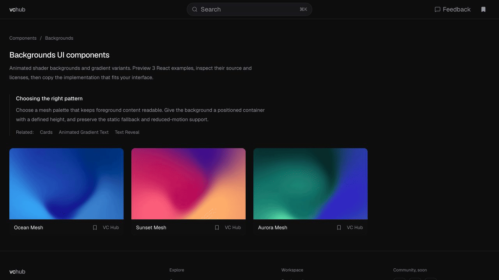

# VC Hub

**Find React UI components. Preview them live. Build your next interface.**

Browse the catalog, try components before using them, and copy code or a prompt for your coding agent.

### [Explore VC Hub →](https://vc-hub.dev)

[Components](https://vc-hub.dev/#browse) · [Themes](https://vc-hub.dev/themes) · [Icons](https://vc-hub.dev/icons)

[View a still screenshot](./assets/vc-hub-preview.png)

**Search → Preview → Copy → Build.**

1. **Search** for a component that fits your interface.
2. **Preview** its appearance and interactions.
3. **Copy** its code or a prompt from the website.
4. **Build** it into your project, following the component's license.

If VC Hub helps you build, **give this repository a star ⭐** to support the project.

---

This is VC Hub's public showcase. Use the product at **[vc-hub.dev](https://vc-hub.dev)**; there is nothing to install from this repository. The website's application source code is private.
